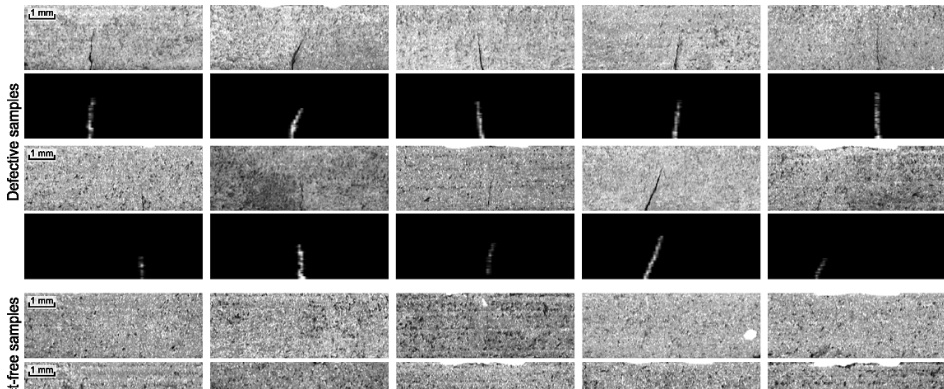
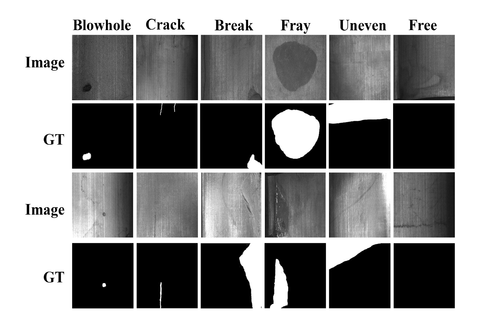
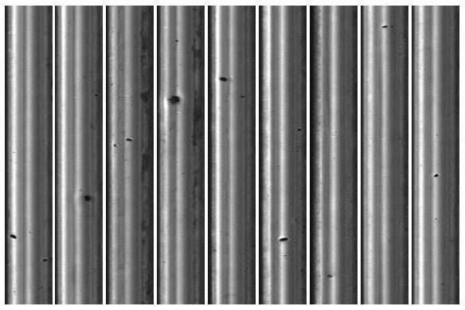

<div align="right">
  <a href="https://github.com/Charmve/Surface-Defect-Detection">English</a> | 简体中文
</div>

# 工业场景表面缺陷检测数据集及论文集 

我不断总结表面缺陷研究领域中的开源数据集（这个非常关键），收集整理了自17年以来的重要论文，可以在<a href="https://github.com/Charmve/Surface-Defect-Detection/tree/master/Papers">:open_file_folder: [<b><i>Papers</i></b>]</a>文件夹下查看。 🐋

<div align=center></div>
<br>

## 前言

<p>目前, 基于机器视觉的表面缺陷装备已经在各工业领域广泛替代人工肉眼检测，包括3C、汽车、家电、机械制造、半导体及电子、化工、医药、航空航天、轻工等行业。传统的基于机器视觉的表面缺陷检测方法，往往采用常规图像处理算法或人工设计特征加分类器方式。一般来说，通常利用被检表面或缺陷的不同性质进行成像方案的设计，合理的成像方案有助于获得光照均匀的图像，并将物体表面缺陷明显的体现出来。近年来，不少基于深度学习的缺陷检测方法也被广泛应用在各种工业场景中。</p>
<br>

<p>对比计算机视觉中明确的分类、检测和分割任务, 缺陷检测的需求非常笼统. 实际上, 其需求可以划分为三个不同的层次: “缺陷是什么”（<b>分类</b>）、“缺陷在哪里”（<b>定位</b>）和“缺陷是多少”（<b>分割</b>）。</p>

# 目录

- [前言](#前言)
- [表面缺陷检测关键问题](#一表面缺陷检测关键问题)
  - [小样本问题](#1小样本问题)
  - [实时性问题](#2实时性问题)
- [常用数据集](#二工业表面缺陷检测常用数据集)
  - [钢材表面数据集：NEU-CLS](#1钢材表面数据集neu-cls)
  - [钢材表面数据集：Severstal(Kaggle)](#kaggle---钢材表面数据集severstal)
  - [太阳能板数据集：elpv-dataset](#2太阳能板数据集elpv-dataset)
  - [金属表面数据集：KolektorSDD](#3金属表面数据集kolektorsdd)
  - [PCB板检测数据集：DeepPCB](#4pcb板检测数据集deeppcb)
  - [面料缺陷数据集：AITEX](#5面料缺陷数据集aitex)
  - [天池布匹缺陷数据集](#6天池布匹缺陷数据集)
  - [天池铝型材表面瑕疵数据集](#7天池铝型材表面瑕疵数据集)
  - [弱监督学习下的工业光学检测（DAGM 2007）](#8弱监督学习下的工业光学检测dagm-2007)
  - [基建表面裂纹检测数据集](#9基建表面裂纹检测数据集)
  - [磁瓦缺陷数据集](#10磁瓦缺陷数据集)
  - [铁轨表面缺陷数据集：RSDDs](#11铁轨表面缺陷数据集rsdds)
  - [Kylberg纹理数据集 v.1.0](#12kylberg纹理数据集-v10)
  - [重复背景纹理数据集 KTH-TIPS](#13KTH-TIPS-database)
  - [手扶电梯梯级缺陷数据集](#14手扶电梯梯级缺陷数据集)
  - [输电线路绝缘子数据集](#15输电线路绝缘子数据集)
  - [MVTec 异常检测数据集](#16MVTec-异常检测数据集)
  - [BSData-用于实例细分和工业磨损预测的数据集](#17BSData-用于实例细分和工业磨损预测的数据集)
  - [GID-齿轮检测数据集](#18齿轮检测数据集)
- [最佳数据集来源盘点](#三最佳数据集来源盘点)
- [论文集](#四表面缺陷检测论文集)
- [致谢](#致谢)
- [下载方式](#下载方式)
- [提示！](#提示)
- [表面缺陷检测交流群](#-表面缺陷检测交流群)

<br>

## 一、表面缺陷检测关键问题

### 1、小样本问题

目前深度学习方法广泛应用在各种计算机视觉任务中, 表面缺陷检测一般被看作是其在工业领域的具体应用。在传统的认识中, 深度学习方法无法直接应用在表面缺陷检测中的原因是因为在真实的工业环境中, 所能提供的工业缺陷样本太少。

相比于ImageNet数据集中1400多万张样本数据, 表面缺陷检测中面临的最关键的问题是小样本问题, 在很多真实的工业场景下甚至只有几张或几十张缺陷图片。实际上, 针对于工业表面缺陷检测中关键问题之一的小样本问题, 目前有4种不同的解决方式:

<b>1）数据扩增、生成</b>

最常用的缺陷图像扩增方法是对原始缺陷样本采用镜像、旋转、平移、扭曲、滤波、对比度调整等多种图像处理操作来获取更多的样本。另外一种较为常见方法是数据合成, 常常将单独缺陷融合叠加到正常(无缺陷)样本上构成缺陷样本。

<b>2）网络预训练与迁移学习</b>

一般来说,，采用小样本来训练深度学习网络很容易导致过拟合, 因此基于预训练网络或迁移学习的方法是目前针对样本中最常用的方法之一。

<b>3）合理的网络结构设计</b>

通过设计合理的网络 结构也可以大大减少样本的需求。基于压缩采样定理来压缩和扩充小样本数据, 使用CNN直接对压缩采样的数据特征进行分类. 相比于原始的图像输入, 通过对输入进行压缩采样能大大降低网络对样本的需求. 此外, 基于孪生网络的表面缺陷检测方法也可以看作是一种特殊的网络设计, 能够大幅减少样本需求。

<b>4）无监督或半监督</b>

在无监督模型中, 只利用正常样本进行训练, 因此不需要缺陷样本. 半监督方法可以利用没有标注的样本来解决小样本情况下的网络训练难题。

👆 [<b>BACK to Table of Contents</b> -->](#目录)

### 2、实时性问题

基于深度学习的缺陷检测方法在工业应用中包括三个主要环节: 数据标注、模型训练与模型推断. 在实际工业应用中的实时性更关注模型推断这一环节. 目前大多数缺陷检测方法都集中在分类或识别的准确性上, 而很少关注模型推断的效率。有不少方法用于加速模型, 例如模型权重量化和模型剪枝等。另外，虽然现有深度学习模型使用GPU作为通用计算单元(GPGPU), 但随着技术发展, 相信FPGA会成为一个具有吸引力的替代方案。

👆 [<b>BACK to Table of Contents</b> -->](#目录)

## 二、工业表面缺陷检测常用数据集
### 1）钢材表面数据集：NEU-CLS

<b>（可用于分类、定位任务）</b>

- :x: 地址：http://faculty.neu.edu.cn/yunhyan/NEU_surface_defect_database.html 

<b> 最新可用地址 🔗 http://faculty.neu.edu.cn/songkechen/zh_CN/zdylm/263270/list/ - ([#16](https://github.com/Charmve/Surface-Defect-Detection/issues/16)) </b>

<div align=center></div>

由东北大学（NEU）发布的表面缺陷数据库，收集了热轧钢带的六种典型表面缺陷，即轧制氧化皮（RS），斑块（Pa），开裂（Cr），点蚀表面（ PS），内含物（In）和划痕（Sc）。该数据库包括1,800个灰度图像：六种不同类型的典型表面缺陷，每一类缺陷包含300个样本。对于缺陷检测任务，数据集提供了注释，指示每个图像中缺陷的类别和位置。对于每个缺陷，黄色框是指示其位置的边框，绿色标签是类别分数。

<div align=center></div>

<br>


### Kaggle - 钢材表面数据集：Severstal

Severstal在高效的钢矿开采和生产方面处于领先地位。 他们认为，冶金的未来需要在该行业的经济，生态和社会各方面进行发展，并且他们认真对待企业责任。 该公司最近创建了该国最大的工业数据湖，其中存储了PB级的数据，这些数据先前已被丢弃。 Severstal现在正在寻求机器学习，以提高自动化程度，提高效率并保持生产的高质量。

https://www.kaggle.com/c/severstal-steel-defect-detection

<br>

👆 [<b>BACK to Table of Contents</b> -->](#目录)

### 2）太阳能板数据集：elpv-dataset

从太阳能板的EL图像中提取有缺陷的太阳能电池数据集。

地址：https://github.com/zae-bayern/elpv-dataset


<div align=center></div>

<br>该数据集包含2,624个300x300像素功能和缺陷太阳能电池的8位灰度图像样本，具有从44个不同的太阳能模块中提取的不同程度的退化。带注释的图像中的缺陷是内部或外部类型的缺陷，已知会降低太阳能模块的功率效率。

<br>所有图像的大小和透视图均已标准化。另外，在提取太阳能电池之前，消除了由用于捕获EL图像的相机镜头引起的任何失真。

<br>

👆 [<b>BACK to Table of Contents</b> -->](#目录)

### 3）金属表面数据集：KolektorSDD

该数据集是由Kolektor Group提供并注释的有缺陷的电子换向器的图像构成的。

具体地说，

- 在电子换向器中嵌入的塑料表面上观察到了微小的碎裂或裂缝；
- 在八个不重叠的图像中捕获每个换向器的表面积；
- 在受控环境中捕获图像。

<div align=center></div>
<br>

官方链接：https://www.vicos.si/Downloads/KolektorSDD

百度网盘链接：https://pan.baidu.com/share/init?surl=HSzHC1ltHvt1hSJh_IY4Jg (提取码：``1zlb``)

该数据集包括：

- 50个例如变形的电子换向器的物理属性；
- 每一个中包含8个表面；
- 总共399张图片；
-- 52张有可见缺陷的图像；
-- 347张没有任何缺陷；
- 原始尺寸图片：
-- 宽度：500 px
-- 高度：从1240到1270像素
- 为了进行训练和评估，图片的尺寸应调整为512 x 1408像素

对于每一个，缺陷仅在至少一张图像中可见，而有两个在图像上有缺陷就意味着有52张图像可见缺陷。其余347张图像用作表面无缺陷的负样本。
<br>

👆 [<b>BACK to Table of Contents</b> -->](#目录)

### 4）PCB板检测数据集：DeepPCB

地址：https://github.com/Charmve/Surface-Defect-Detection/tree/master/DeepPCB

<div align=center>
&nbsp;&nbsp;&nbsp;&nbsp;&nbsp;
 
 </div>
<div align=center>
 a. 测试机图片样例 
 &nbsp;&nbsp;&nbsp;&nbsp;&nbsp;&nbsp;&nbsp;&nbsp;&nbsp;&nbsp;&nbsp;&nbsp;&nbsp;&nbsp;&nbsp; &nbsp;&nbsp;&nbsp;&nbsp;&nbsp;&nbsp;&nbsp;&nbsp;&nbsp;&nbsp;&nbsp;&nbsp;&nbsp;&nbsp;&nbsp;&nbsp;&nbsp;&nbsp;&nbsp;&nbsp;&nbsp;&nbsp;&nbsp;
  b. 对应的模板图片
 </div>

<p align=center>图1. PCB板检测数据集</p>

<br>

👆 [<b>BACK to Table of Contents</b> -->](#目录)

### 5）面料缺陷数据集：AITEX

数据集下载链接：

https://pan.baidu.com/s/1cfC4Ll5QlnwN5RTuSZ6b7w (提取码：``b9uy``)

该数据库由七个不同织物结构的245张4096 x 256像素图像组成。数据库中有140个无缺陷图像，每种类型的织物20个，除此之外，有105幅纺织行业中常见的不同类型的织物缺陷（12种缺陷）图像。图像的大尺寸允许用户使用不同的窗口尺寸，从而增加了样本数量。Internet上的数据库还包含所有具有缺陷的图像的分割mask，使得白色像素表示缺陷区域，其余像素为黑色。


<div align=center></div>

<br>

👆 [<b>BACK to Table of Contents</b> -->](#目录)

### 6）天池布匹缺陷数据集

数据下载链接：

https://pan.baidu.com/s/1LMbujxvr5iB3SwjFGYHspA (提取码：``gat2``)


在布匹的实际生产过程中，由于各方面因素的影响，会产生污渍、破洞、毛粒等瑕疵，为保证产品质量，需要对布匹进行瑕疵检测。布匹疵点检验是纺织行业生产和质量管理的重要环节，目前人工检测易受主观因素影响，缺乏一致性；并且检测人员在强光下长时间工作对视力影响极大。由于布匹疵点种类繁多、形态变化多样、观察识别难道大，导致布匹疵点智能检测是困扰行业多年的技术瓶颈。本数据涵盖了纺织业中布匹的各类重要瑕疵，每张图片含一个或多种瑕疵。数据包括包括素色布和花色布两类，其中，素色布数据约8000张，用于初赛；花色布数据约12000张，用于复赛。

<br>

👆 [<b>BACK to Table of Contents</b> -->](#目录)

### 7）天池铝型材表面瑕疵数据集

数据集下载链接：

https://tianchi.aliyun.com/competition/entrance/231682/information

数据集介绍：在铝型材的实际生产过程中，由于各方面因素的影响，铝型材表面会产生裂纹、起皮、划伤等瑕疵，这些瑕疵会严重影响铝型材的质量。为保证产品质量，需要人工进行肉眼目测。然而，铝型材的表面自身会含有纹路，与瑕疵的区分度不高。传统人工肉眼检查十分费力，不能及时准确的判断出表面瑕疵，质检的效率难以把控。近年来，深度学习在图像识别等领域取得了突飞猛进的成果。铝型材制造商迫切希望采用最新的AI技术来革新现有质检流程，自动完成质检任务，减少漏检发生率，提高产品的质量，使铝型材产品的生产管理者彻底摆脱了无法全面掌握产品表面质量的状态。大赛数据集里有1万份来自实际生产中有瑕疵的铝型材监测影像数据，每个影像包含一个或多种瑕疵。供机器学习的样图会明确标识影像中所包含的瑕疵类型。

<div align=center></div>

<br>

👆 [<b>BACK to Table of Contents</b> -->](#目录)

### 8）弱监督学习下的工业光学检测（DAGM 2007）

Weakly Supervised Learning for Industrial Optical Inspection

数据下载链接：

https://hci.iwr.uni-heidelberg.de/node/3616

<div align=center></div>

<br>

数据集介绍：

- 主要针对纹理背景上的杂项缺陷。

- 较弱监督的训练数据。

- 包含十个数据集，前六个为训练数据集，后四个为测试数据集。

- 每个数据集均包含以灰度8位PNG格式保存的1000个“无缺陷”图像和150个“有缺陷”图像。每个数据集由不同的纹理模型和缺陷模型生成。

- “无缺陷”图像显示的背景纹理没有缺陷，“无缺陷”图像的背景纹理上恰好有一个标记的缺陷。

- 所有数据集已随机分为大小相等的训练和测试子数据集。

- 弱标签以椭圆形表示，大致表示缺陷区域。         

<br>

👆 [<b>BACK to Table of Contents</b> -->](#目录)

### 9）基建表面裂纹检测数据集

``Cracks on the surface of the construction``数据集是github上的一个项目，主要是一些基建（水泥表面裂纹），可以访问项目连接：https://github.com/cuilimeng/CrackForest-dataset 或者百度云链接：https://pan.baidu.com/s/1108j5QbDr7T3XQvDxAzVpg （提取码：``jajn``）下载。

<div align=center></div>
<br>

<p align=center>图2. 桥梁裂缝（左）和路面裂缝（右）</p>

- <b>桥梁裂缝</b>. 有2688张没有像素级地面真实情况的桥梁裂缝图像，来自于"Liangfu Li, Weifei Ma, Li Li, Xiaoxiao Gao". 数据集可通过此链接访问： https://github.com/Charmve/Surface-Defect-Detection/tree/master/Bridge_Crack_Image.

- <b>路面裂缝</b>. 该数据集来自于 Shi Yong, and Cui Limeng and Qi Zhiquan and Meng Fan and Chen Zhensong. 原始数据集可通过此链接访问 https://github.com/Charmve/Surface-Defect-Detection/tree/master/CrackForest. 我们提取像素级地面真相的图像文件。

<br>

👆 [<b>BACK to Table of Contents</b> -->](#目录)

### 10）磁瓦缺陷数据集

Magnetic tile dataset, 该数据集是由abin2收集的，现已开源，你可以从这下载 [https://github.com/Charmve/Surface-Defect-Detection/tree/master/Magnetic-Tile-Defect](https://github.com/Charmve/Surface-Defect-Detection/tree/master/Magnetic-Tile-Defect)，它被用在了论文"Surface defect saliency of magnetic tile"中。（点击[这里](https://link.springer.com/article/10.1007/s00371-018-1588-5) 或 [这里](https://ieeexplore.ieee.org/document/8560423)可以查看论文）

 

<p align=center>图3. 数据集概述.</p>

这同样也是论文“Saliency of magnetic tile surface defects”的数据集，它收集了6个常见磁砖缺陷的图像，并标记了它们的像素级地面真相。

<br>

👆 [<b>BACK to Table of Contents</b> -->](#目录)

### 11）铁轨表面缺陷数据集：RSDDs

RSDDs数据集包含两种类型的数据集：第一种是从快车道捕获的I型RSDDs数据集，其中包含67个具有挑战性的图像。第二个是从普通/重型运输轨道捕获的II型RSDDs数据集，其中包含128个具有挑战性的图像。

两个数据集的每幅图像至少包含一个缺陷，并且背景复杂且噪声很大。

RSDDs数据集中的这些缺陷已由一些专业的人类观察员在轨道表面检查领域进行了标记。

<div align=center></div>
<br>

官方链接：http://icn.bjtu.edu.cn/Visint/resources/RSDDs.aspx

链接：https://pan.baidu.com/share/init?surl=svsnqL0r1kasVDNjppkEwg （提取码：``nanr``）

<br>

👆 [<b>BACK to Table of Contents</b> -->](#目录)

### 12）Kylberg纹理数据集 v.1.0

<div align=center></div>
<p align=center>图4. 28个纹理类中的每一个的示例补丁。</p>

该数据集：
- 28个纹理类，请参见图4。
- 每个分类下有160个独特的纹理补丁。（每个原始补丁有12个旋转的替代数据集，每个类160 * 12 = 1920个纹理补丁）
- 纹理补丁大小：576x576像素。
- 文件格式：无损压缩8位PNG。
- 所有补丁均以127的平均值和40的标准偏差进行标准化。
- 每个纹理类一个目录。
- 文件的命名如下：blanket1-d-p011-r180.png，其中``blanket1``是类名，``d``是原始图像样本编号（可能的值是a，b，c或d），``p011``是补丁编号11，``r180``补丁旋转了180度。

官方链接:http://www.cb.uu.se/~gustaf/texture/

👆 [<b>BACK to Table of Contents</b> -->](#目录)

### 13）KTH-TIPS database

重复背景纹理数据集，样例图片如下，官方网址：https://www.nada.kth.se/cvap/databases/kth-tips/download.html

网盘下载链接：

数据集1：https://pan.baidu.com/s/173h8V66yRmtVo5rc2P7J4A

数据集2：https://pan.baidu.com/s/1dXFKn6v2PV5QS9m8gWlifA


👆 [<b>BACK to Table of Contents</b> -->](#目录)

### 14）手扶电梯梯级缺陷数据集 

官方网址：https://aistudio.baidu.com/aistudio/datasetdetail/44820


👆 [<b>BACK to Table of Contents</b> -->](#目录)

### 15）输电线路绝缘子数据集

数据集中，Normal_Insulators包含由无人机捕获的绝缘子图像，数量为600张。
Defective_Insulators包含有缺陷的绝缘体，绝缘子缺陷图像的数量为248张。
数据集中包括数据集和标签。

<div align=center></div>

官方链接：https://github.com/InsulatorData/InsulatorDataSet


👆 [<b>BACK to Table of Contents</b> -->](#目录)


### 16）MVTec 异常检测数据集

数据网站：http://www.mvtec.com/company/research/datasets

该数据集包含15个类别的物体和纹理共5K+张彩色图像。15个类别中涵盖了不同类型的规则纹理(地毯，格子)和随机纹理(皮革，瓷砖，木材)。除外还有：瓶子、金属螺母，电缆等。异常样本图像包含多种缺陷，缺陷是手工生成的。所有的图像分辨率都在700×700和1024×1024像素之间。该数据集并给出了ground truth。

<div align=center>
  
</div>

### 17）BSData-用于实例细分和工业磨损预测的数据集

该数据集包含1104个通道3个图像，带有394个图像注释，用于表面损伤输入“点蚀pitting”。 使用注释工具[labelme](https://github.com/wkentaro/labelme) 进行的注释，可提供``JSON``格式，因此可以转换为VOC和COCO格式。 所有图像都来自两种BSD类型。

另一种BSD类型显示在325张具有两种图像尺寸的图像上。 由于所有此类图像都是连续拍摄的，因此有不同程度的污染。

另外，数据集每69张图像包含如上所述的27个点蚀显影序列。

<p align=center>
  
  Figure 5. On the left image-examples, on the right associated PNG-Annotations.
</p>

🔗 Offical link https://github.com/2Obe/BSData

> 感谢 @Beñat Gartzia 的推荐和大家的关注和支持!


👆 [<b>BACK to Table of Contents</b> -->](#目录)

### 18）GID 齿轮检测数据集

齿轮检测数据集（GID）是为百度（中国）有限公司举办的 "全国人工智能创新应用大赛 "的数据集。它有两千张灰度图片，有28575个注释，用于描述来自真实世界的三类缺陷。每张图片都包括在一个单独的JSON文件中描述的缺陷，包括图片名称、标签类别、边界框和用于分割的多边形。然而，标记类别的标签并不包括关于其类型的具体信息，而只是数字，因此发现它们与其他相关数据集的相似性是具有挑战性的。

<p align=center>
  
  图6. 验证测试图像的例子和它们的标签。
</p>

🔗 Offical link http://www.aiinnovation.com.cn/#/dataDetail?id=34

- 下载链接：
  - 齿轮检测训练数据集: https://pan.baidu.com/s/17HoFfBUQGeX7G0ibkPExrw (密码: hm7k) 
  - 齿轮检测A榜评测数据集: https://pan.baidu.com/s/157Zf7hcTM78GhXtXI5ySFQ (密码: 2R6K)
  - 齿轮检测B榜评测数据集: https://pan.baidu.com/s/1OjOZotqlRSvsYLA_qH2nXA (密码: hypd)
  
- Mirrors:
  - 齿轮检测训练数据集: https://drive.google.com/file/d/1CZo-Ab5BXkTjV-b1-NIFzYMjfJQMl4nG/view?usp=share_link
  - 齿轮检测A榜评测数据集: https://drive.google.com/file/d/1-0sSrmhElBseeZWICu77lzTxoOiRD8yG/view?usp=share_link
  - 齿轮检测B榜评测数据集: N/A.
  
 注意：竞赛数据集不用于商业用途。

👆 [<b>BACK to Table of Contents</b> -->](#目录)

<br>

## 三、最佳数据集来源盘点

我一直在收集表面缺陷检测数据集，但依然还有很多方向的数据集未收集到。大家对于本 repo 未收集到的数据集，可以到以下几个站点查看。<b>同时，十分欢迎大家分享新的数据集，成为本项目的共同维护者。</b>


|站点|链接|推荐指数|
|--|--|--|
|Kaggle|https://www.kaggle.com/datasets|⭐⭐⭐⭐⭐|
|Paper With Code |https://paperwithcode.com/sota|⭐⭐⭐⭐⭐|
|亚马逊数据集|https://registry.opendata.aws|⭐⭐⭐|
|UCI机器学习库|https://archive.ics.uci.edu/ml/datasets.html |⭐⭐⭐|
|谷歌的数据集搜索引擎|https://toolbox.google.com/datasetsearch |⭐⭐⭐⭐|
|微软数据集|https://msropendata.com |⭐⭐⭐|
|Awesome公共数据集|https://github.com/awesomedata/awesome-public-datasets |⭐⭐|

👆 [<b>BACK to Table of Contents</b> -->](#目录)

<br>

## 四、表面缺陷检测论文集

收集一些表面缺陷检测的文章，主要检测对象是：金属表面、LCD屏、建筑、输电线等缺陷或异常检物。方法以分类方法、检测方法、重构方法、生成方法为主。电子版论文放在了paper文件的对应日期文件下。

详见本仓库 <a href="https://github.com/Charmve/Surface-Defect-Detection/tree/master/Papers">:open_file_folder: [<b><i>Papers</i></b>]</a>

<br>

👆 [<b>BACK to Table of Contents</b> -->](#目录)

## 致谢

<p>你能看到这个项目，我们应当感谢上述数据集最初开源的人，他们给我们的学习和研究工作带来了极大的帮助。这个数据集的收集想法起初来自于看了“AI算法修炼营”SFXiang的一篇关于表面缺陷检测的文章，促使我整理一份更为全面的数据集。论文集来自于一位叫“庆志的小徒弟”的CSDNer，现在论文收集只到2019年11月份，之后会继续完善。<strong>同时，希望能有更多小伙伴上传新的数据集。Feel free to <a href="https://github.com/Charmve/Surface-Defect-Detection/blob/master/CONTRIBUTING.md" target="_blank">CONTRIBUTE</a>.</strong></p>

<p>最后，我想再次感谢以上数据集的开源贡献者。</p>

<br>

👆 [<b>BACK to Table of Contents</b> -->](#目录)

<br>

<a href="https://charmve.github.io/sponsor.html"></a>

## &nbsp;&nbsp; Supporting

&nbsp;&nbsp;&nbsp;&nbsp;  Support this project by becoming a sponsor. Your logo will show up <b>our homepage</b> with a link to your website. 🙏

<br>
<p align="center">
    <a href="https://charmve.github.io/sponsor.html" target="_blank"></a>
</p>

<div align="left">
    <a href="https://opencollective.com/surfacedd#sponsors" target="_blank"></a>
</div>

<br>

👆 [<b>BACK to Table of Contents</b> -->](#目录)

## 下载方式
- Github 下载ZIP, 点击[这里](https://github.com/Charmve/Surface-Defect-Detection/archive/master.zip)
  <br>或者在终端运行 ```git clone https://github.com/Charmve/Surface-Defect-Detection.git```。<br>
- 百度网盘下载链接:https://pan.baidu.com/s/122WY8F5VKqm3qMirqebRQw ``提取码:i20n``

<br>

👆 [<b>BACK to Table of Contents</b> -->](#目录)

## 提示！

<p>本开源数据集最初是由许多人贡献的，只是太过分散，对寻找数据集是个十分费时费力的过程。很多数据集是研究者论文的训练/测试集，或是企业的开源数据集，因此 <strong>您只能将此数据集用于研究目的。</strong></p>

<p>如您有任何疑问和想法，欢迎来信交流 :email: yidazhang1@gmail.com</p>

## 🍮 表面缺陷检测交流群
- Github <a href="https://github.com/Charmve/Surface-Defect-Detection/discussions" target="_blank">discussions 💬</a> or <a href="https://github.com/Charmve/Surface-Defect-Detection/issues" target="_blank">issues 💭</a>

- QQ群: 734758251 (密码：哈哈哈)
- 微信群：加我拉你进群 Yida_Zhang2
- Email: yidazhang1#gmail.com

## 引用方式
Use this bibtex to cite this repository:
```
@misc{Surface Defect Detection,
  title={Surface Defect Detection: Dataset and Papers},
  author={Charmve},
  year={2020.09},
  publisher={Github},
  journal={GitHub repository},
  howpublished={\url{https://github.com/Charmve/Surface-Defect-Detection}},
}
```

## Stargazers over time

[](https://starchart.cc/Charmve/Surface-Defect-Detection)

<br>
* <i>Update on Dec 21，2020 @<a href="https://github.com/Charmve" target="_blank">Charmve</a>, 
    <a class="github-button"
        href="https://github.com/Charmve/Surface-Defect-Detection"
        data-icon="octicon-star" data-show-count="true"
        aria-label="Star Charmve/Surface-Defect-Detection on GitHub">Star</a> 
    and 
    <a class="github-button"
        href="https://github.com/Charmve/Surface-Defect-Detection/fork"
        data-icon="octicon-repo-forked" data-show-count="true"
        aria-label="Fork Charmve/Surface-Defect-Detection on GitHub">Fork</a>
</i>

